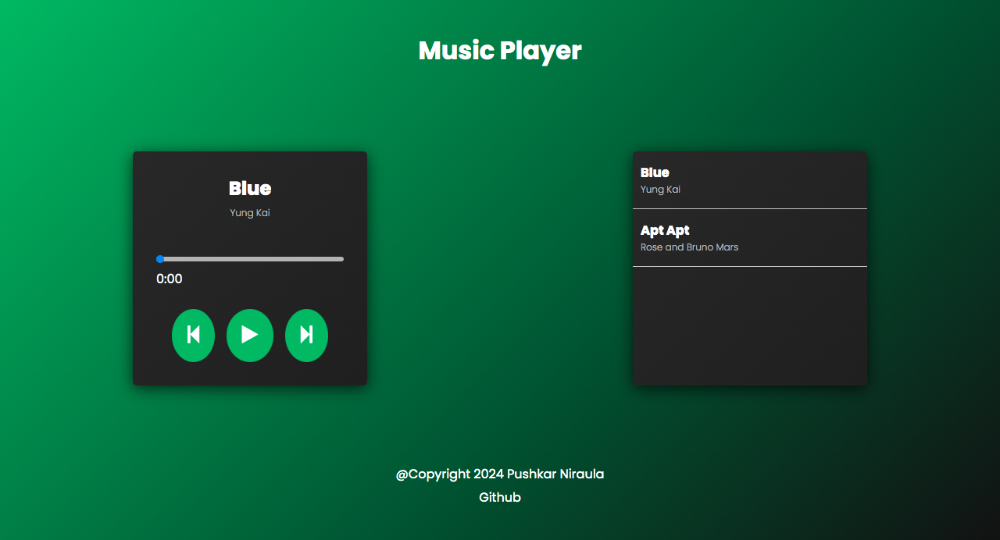

# Music Player

It is a sleek and modern music player built with HTML, CSS, and JavaScript. It provides a smooth user experience with responsive design, a custom UI, and easy-to-use controls for listening to your favorite tracks.

---

## Screenshot



---

## Features

- Play, Pause for easy control of your music.
- Displays current song name and artist.
- Responsive layout for both desktop and mobile devices.
- Clean, modern design using CSS for a minimalistic look.

---

## Tech Stack

- **HTML5**: Structure of the web page.
- **CSS3**: Styles for the layout, buttons, and responsiveness.
- **JavaScript**: For handling audio control, player interaction, and dynamic updates.

---

## Demo

You can see a live demo of the project here:

[SoundWave Demo](https://www.pushkarniraula.com.np/music-player)

---

## Installation

To get started with this project on your local machine, follow these steps:

1. **Clone the repository**:

   ```bash
   git clone https://github.com/puskarpy/audio-player.git

   ```

2. **Navigate to the project folder**:
   ```bash
   cd audio-player
   ```

---

# Customizing

You can easily customize the player by:

- **Changing the Audio Files**: Replace or add the .mp3 files in the /audios/ directory with your own music tracks.
- **Styling**: Modify style.css to change the appearance, layout, or colors of the player.
- **Song List**: Update the song list in index.html with your preferred songs.

---

# License

This project is licensed under the MIT License

---

# Author

Pushkar Niraula

- [Portfolio](https://www.pushkarniraula.com.np)

---

# Acknowledgements

- **FontAwesome** for providing icons used in the project.
- **Google Fonts** for the custom font (Poppins) used in the design.
